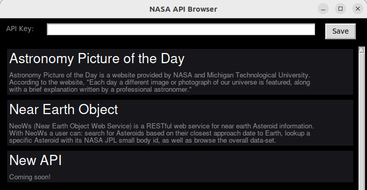
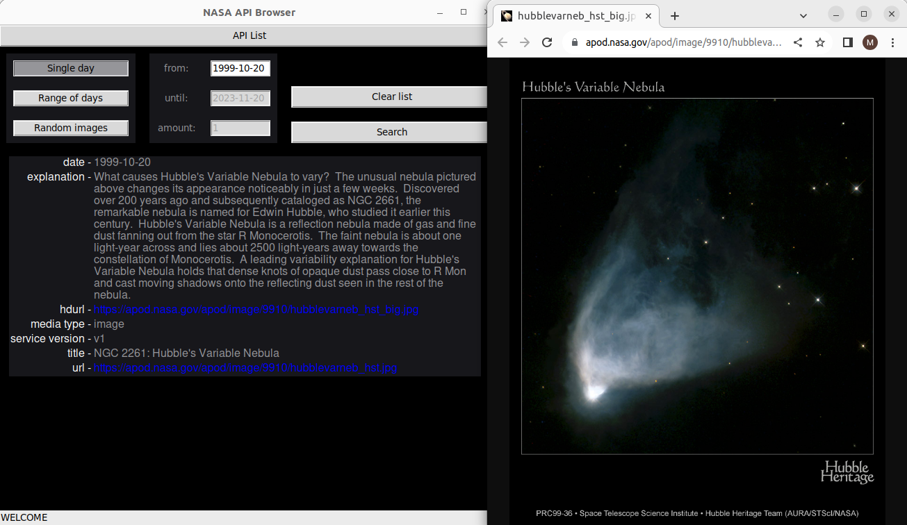
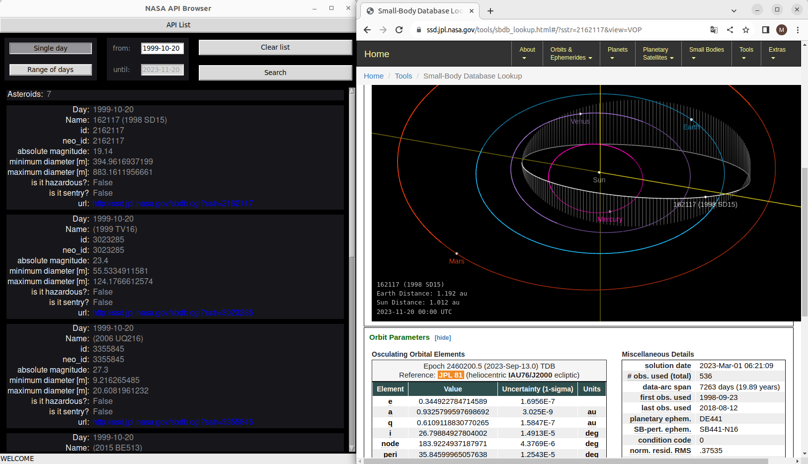

## NASA API Browser

App for easy NASA API browsing.



## Requirements

* Python >=3.10

## Installation

Ubuntu 22.04

```bash
git clone https://github.com/MarcinNarozny/NASA-API-Browser.git
cd NASA-API-Browser
python3 -m app
```

## Usage

You need to generate your very own API key on NASA's [website](https://api.nasa.gov/). You are going to receive the key via e-mail. When you get it, you can go ahead and paste it into the app's API Key box and save it. From now on, you can browse all supported APIs.

## Supported APIs

### APOD

This API allows you to look up NASA's Astronomy Picture of the Day on a specific date. It can be a single day, a range of days, or you can pick some random images too. Here is what an APOD looked like on my birthday:



### NEO

This API lets you find out what asteroids flew by the Earth on a specific date or in some time span. You can visit the asteroid's own website to see more detail, for example, what its orbit looks like and how far it is from Earth right now. Here is some information about asteroids that got near Earth on my birthday:



### More APIs coming soon
